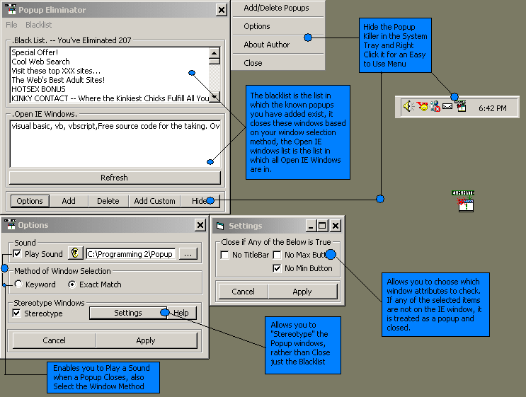



## Fully Functional Pop\-up Killer \(Updated\) \!

### Description

The update to the Complete Popup-Killer, it has a new option called "Stereotype Windows". This option Closes windows if they look like they might be popups, in Ex: no Min Button, no Max Button, no TitleBar ... it is an option, so you can turn it off if you want. You may also select which of the 3 you want it to look for. This is to prevent having to add each individual popup to the blacklist. It still has everything it had before, including the Quick Closing Speed, Sound on kill Option, Exact Title of Window Match or Keyword. It is now, i think, the Best Popup-Killer i've seen. Also, Thanks for your Help LaVolpe
 
### More Info
 

             |
---                |---
**Submitted On**   |2002-10-20 18:30:12
**By**             |[Robert Cleaver](https://github.com/Planet-Source-Code/PSCIndex/blob/master/ByAuthor/robert-cleaver.md)
**Level**          |Advanced
**User Rating**    |4.9 (69 globes from 14 users)
**Compatibility**  |VB 6\.0
**Category**       |[Complete Applications](https://github.com/Planet-Source-Code/PSCIndex/blob/master/ByCategory/complete-applications__1-27.md)
**World**          |[Visual Basic](https://github.com/Planet-Source-Code/PSCIndex/blob/master/ByWorld/visual-basic.md)
**Archive File**   |[Fully\_Func14845610202002\.zip](https://github.com/Planet-Source-Code/robert-cleaver-fully-functional-pop-up-killer-updated__1-39932/archive/master.zip)

